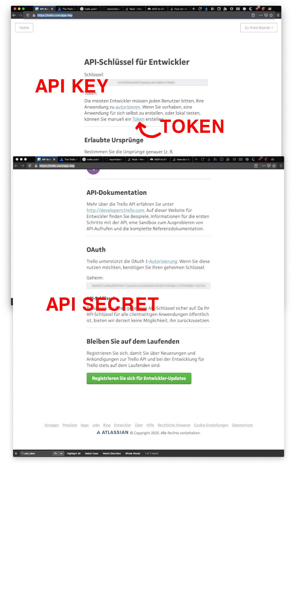
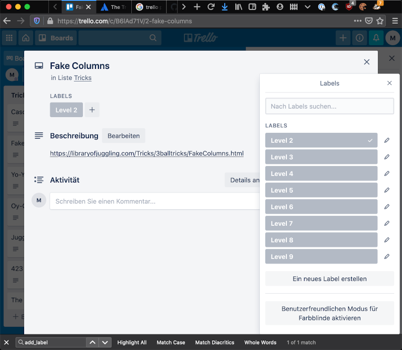

# library-of-juggling-to-trello

The Library of Juggling has a superb collection of juggling tricks with expressive GIFs to show you how to learn the trick.
So I thought How about to have a Trello board to keep track of my learning experience and here we are.

1. Get API Information
Go to `https://trello.com/app-key` and get *API key*, *API secret* and *token* from there. 
I found it kind of confusing so stick to my screenshot (it is in German, but you will recognize what you need).

 

2. Create `.env` File
Rename `.env-template` to `.env` and enter gathered API information.

2. Run Script
Create a virtual environment with Python 3 and run `main.py`.

3. Give Labels a Color
I could not figure out how to add a color to the labels, so please do the dirty work for me.
 

4. Give Board a Background
Give your Trello board a fitting background image (hint: search for `balls`, not `juggling`).

5. Profit
